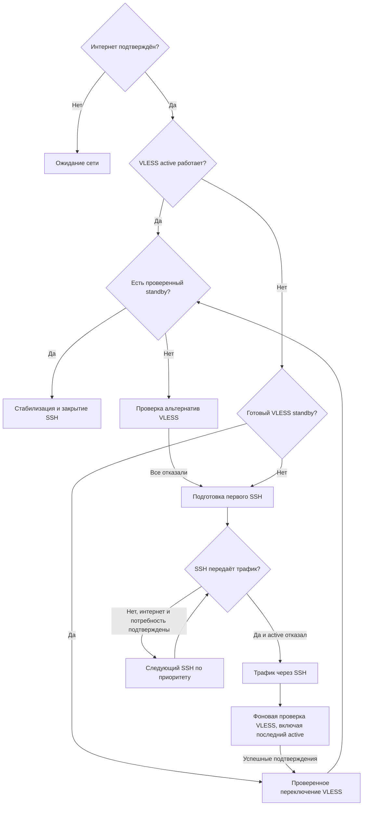

# Архитектура и восстановление

## Контуры управления

`daemon.py` координирует health-проверки и переключения. `emergency.py` принимает решение о необходимости SSH; `tunnels.py` управляет его процессом. В обычном режиме SSH-supervisor читает только локальное состояние.

Параллельно работают:

- **Основной цикл:** состояние интернета, health active, решение о promotion/SSH, агрегированные статусы.
- **Standby worker:** последовательная проверка кандидатов во временном xray. Он публикует готовый слот и будит основной цикл, но не пишет production-конфиг.
- **SSH supervisor:** один принадлежащий xproxy процесс, одна выполняющаяся e2e-проверка, последовательные попытки. Повторно читает условия перед подключением, включая завершение локальной подготовки.
- **Maintenance:** подписка, geo, deferred rebuild и автообновление. Загрузки не блокируют основной health-цикл; публикация конфигурации сериализована.
- **Notifier:** очередь Telegram и доставка через действующий xray либо напрямую, с общим состоянием сети.
- **Config sync:** один фоновый sender публикует сохранённый VLESS-конфиг после подтверждённой смены upstream. Возврат с SSH сравнивается с последним VLESS; аварийный конфиг не публикуется. Очередь хранит только последнюю ожидающую версию, отправки сериализованы. В `--once` SCP завершается до выхода процесса.

`Connectivity` хранит ограниченное по времени свидетельство доступа в интернет, поколение и локальную сигнатуру default route. Чтение этого объекта не выполняет I/O. Во всех точках принятия решений используется одна базовая проверка `internet_alive()`, независимая от xray и состояния VLESS/SSH:

1. Последовательный ICMP echo к публичным IP `8.8.8.8`, `1.1.1.1`, `9.9.9.9`, до первого успеха. DNS не используется. Для macOS/Linux запускается `ping -n -c 1` с ограничением процесса в 2 секунды; различающиеся между платформами флаги таймаута не нужны. В поиске `ping` учитываются `/sbin` и `/usr/sbin`, даже если их нет в PATH сервиса.
2. Если ping отсутствует, запрещён правами/сетью или все адреса не ответили — последовательные прямые HTTPS GET к `https://ya.ru/`, `https://www.apple.com/library/test/success.html`, `https://www.gstatic.com/generate_204`, до первого успеха. Проверяется TLS и получение HTTP-заголовков; любой обычный ответ 200–599 подтверждает связность. Тело не скачивается, редиректы не выполняются, env-прокси игнорируются. Таймаут подключения — 2 секунды, чтения — 3 секунды; это не общий deadline, в частности системное разрешение DNS может занять больше времени.

Эта же проверка повторно подтверждает сеть перед новым SSH-подключением, после отказа туннеля и перед переходом к следующему SSH-хосту. Отказ кандидата VLESS также засчитывается только после подтверждения базового интернета. Проверка текущего прокси через IP-checker/Telegram выполняется отдельно и не переопределяет базовое состояние сети. Успешный ping подтверждает наличие связи, но не исправность DNS или доступность нужных ресурсов.

Если ни ICMP, ни HTTPS не подтвердили доступ, проверки маршрутов и SSH-подключения приостанавливаются. Недоступность всех контрольных адресов может быть следствием фильтрации, а не полного обрыва: без подтверждения базовой связности скрытые SSH-хосты не перебираются. Уже работающий трафик не отключается из-за одного этого результата. Прямые пробы следуют системной маршрутизации, включая системный VPN/TUN, если он настроен.

## Подготовка VLESS

Кандидаты берутся из локального кэша, затем актуализируются подпиской/DNS после появления интернета. Приоритет задают `country.lst`, отличие страны от active и временные штрафы. Адрес работающего active исключён из независимого standby. Если active отказал, обновлённые UUID/Reality-параметры того же endpoint разрешено проверить и применить как восстановление. Такой кандидат не считается независимым резервом; если старый active восстановился сам, слот с вариантом его конфигурации сбрасывается. В SSH-режиме последний VLESS включён в поиск наравне с остальными.

Проверка кандидата:

1. TCP до VLESS endpoint, сборка production-конфига, `xray -test`.
2. Временный xray на двух свободных loopback-портах: обычный SOCKS с production routing и отдельный SOCKS, принудительно направленный в `proxy` outbound.
3. IP-check через принудительный upstream, затем IP-check/целевые ресурсы с production routing.
4. Повторный fingerprint и проверка поколения сети/входов; завершение временного процесса в `finally`.

Fingerprint учитывает параметры VLESS, template/routing/direct list, geo-assets и окружение сервиса. READY/PRE_STALE не переживают рестарт как доверенный факт. Подготовка на старом поколении не публикуется и не штрафует маршрут. Полный неудачный проход повторяется; штраф не означает вечное исключение кандидата. Успешная публикация standby завершает текущий проход: после потери этого резерва поиск начинается заново, без переноса списка уже проверенных кандидатов из прошлого эпизода.

## Запись и rollback

Все внутренние писатели production-конфига используют `_apply_lock`. Health-проверка active и решение по её результату используют ту же блокировку, поэтому промежуточное отключение listener при maintenance restart не вызывает штрафов или переключения. Отложенные promotion и локальный repair перепроверяют необходимость действия после получения блокировки. Смена поколения сети отменяет результаты незавершённой health-проверки. На уровне установки `state/daemon.lock` исключает второй daemon/once. Публикация geo-набора использует тот же apply-lock и валидирует конфиг текущего транспорта, поэтому geo-refresh не возвращает старый VLESS поверх SSH.

Транзакция:

1. Проверить конфиг и актуальность условий после локальной валидации.
2. Сохранить предыдущий текст и hash следующей версии в `state/config-transition.json`, также обновить обычный backup.
3. Записать конфиг и перезапустить xray; дождаться production listener. Временный xray не считается работающим production-сервисом.
4. Проверить трафик, актуальность сети и входных данных. После успеха зафиксировать переход, сохранить последний хороший VLESS-конфиг и удалить журнал.
5. При ошибке восстановить точную предыдущую версию из журнала, проверить запуск и отдельно — трафик после отката. Ошибка отката отражается в Telegram; восстановление файла не объявляется восстановлением канала.

Запись использует соседний временный файл и rename. Для уже установленных старых Linux sudoers сохранён совместимый fallback через прямой `sudo tee`, если атомарный путь не разрешён; обновите sudoers из `deploy/`, чтобы использовать атомарную запись. Журнал создаётся до записи и защищает последующее восстановление также в этом fallback.

При старте незавершённая транзакция разбирается до новых записей. Сначала xray явно перезапускается с конфигом на диске: здоровый старый процесс мог ещё не загрузить записанную версию. Это требуется и при совпадении файла с предыдущей версией — crash мог произойти между записью rollback и его перезапуском. После загрузки нового конфига и проверки трафика переход фиксируется; при неудаче предпринимается rollback. Затем daemon заново определяет транспорт/active и сбрасывает старые результаты проверок до health-цикла и maintenance. Без интернета восстановление откладывается. Если первая активация прервалась до создания какого-либо конфига, пустая транзакция закрывается для новой проверенной активации. Неожиданно изменённый внешней программой конфиг автоматически не затирается: конфликт журнала требует диагностики. Не редактируйте production-конфиг одновременно с xproxy.

## Состояние на диске

| Файл в `state/` | Назначение |
|---|---|
| `active.json` | Последний активный VLESS; сохраняется при SSH |
| `servers.json` | Кэш текста подписки |
| `daemon.lock` | Lease единственного писателя |
| `ssh-process.json` | Проверяемая запись владения SSH-процессом |
| `ssh.log`, `ssh.log.1` | Локальная диагностика SSH, ротация между попытками |
| `config-transition.json` | Незавершённая транзакция конфигурации |
| `xray_config.backup.json` | Предыдущая версия config.json; она не обязательно рабочая |
| `vless.last-good.json` | Последний зафиксированный проверенный VLESS-конфиг |
| `notify_queue.json` | Неотправленные события |
| `geo_state.json` | Планирование/результаты geo-загрузок |

`state/` имеет права 0700, сохраняемые чувствительные файлы — 0600. Фактический транспорт после рестарта определяется по конфигу xray. Ни active.json, ни старая запись SSH PID не заменяют свежую проверку трафика.

## Завершение и платформы

SIGTERM/SIGINT останавливает планирование, будит worker-ы, завершает временные xray и собственный SSH, сохраняет уведомления. Перед self-exec фоновые писатели, включая уже начатую SCP-публикацию VLESS, завершаются под lease, а SSH сохраняется для принятия новым процессом. Обычное завершение SSH не восстанавливает непроверенный VLESS вслепую.

Управление SSH не зависит от systemd, Linux `/proc` или shell-циклов: используются subprocess, OpenSSH, `ps` и сигналы, доступные на обеих платформах. `fcntl.flock` обеспечивает lease. Платформенные различия изолированы в `platform_utils.py` и шаблонах deployment.

## Проверка реализации

`tests/run.py` копирует пакет, тесты и шаблоны во временный каталог без `.env`, live-конфигов и `state/`. Audit hook запрещает немокированные connect/DNS/subprocess. Сценарии включают полный переход VLESS→SSH→VLESS, отсутствие любых SSH-попыток в normal/offline, восстановление текущего перед резервами, отзыв потребности, hot reload, миграцию владения, rollback и доставка очереди.

Для реального развёртывания проверяются service-user/ключи/known_hosts, forwarding на удалённой стороне и права xray. Пробовать резервные SSH-хосты для такой проверки профилактически не требуется: их использование должно оставаться обусловленным аварийной политикой.
